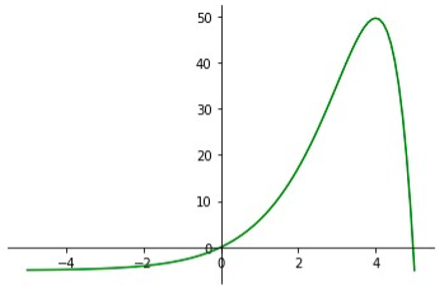

# A numerical derivation of Wien's Law

Pen-on-paper differentiation is used to determine the maximum point of Planck's law. Simple substitutions give an equation in which the Newton-Raphson method (NRM) can be applied to solve for its roots. The NRM does not always converge. Its convergence theory is for "local" convergence which means you should start close to the root, where "close" is relative to the function you're dealing with. For this reason, the equation was plotted so that a good initial guess could be found. 

 
**Figure 1**: Plot of spectral radiance against a dimensionless parameter (defined in .py file). The function has one non-trivial root.
 

An appropriate initial guess would be approximately 5. Knowing there is a root at 0, the initial value can't be too small, or the NRM will solve for that root. 
